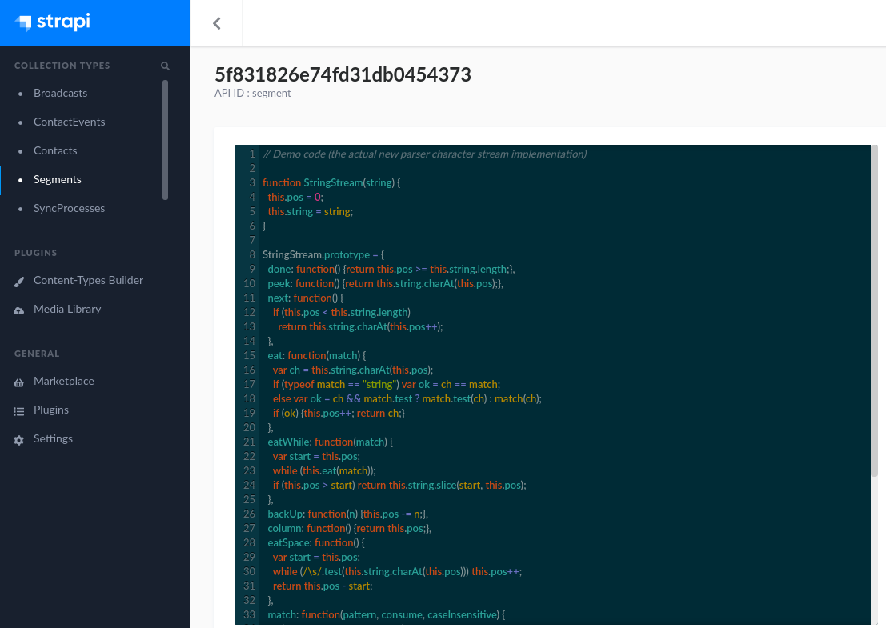

# Strapi plugin strapi-plugin-codemirror

Plugin enabling [CodeMirror](https://codemirror.net/demo/theme.html) editor for Strapi textaera field.

_Please keep in mind that the plugin replaces the textarea field._

## How it works
--------
The plugin replaces/overrides the `textarea` field to a CodeMirror field. 
The field's language can be configured by a model property named `mode` 
which defines the CodeMirror mode ([available modes](https://codemirror.net)). 

## How to install
--------
1. Under the root folder of your project run 

NPM:
   ```
   npm install strapi-plugin-codemirror --save
   ```
YARN:
   ```
   yarn add strapi-plugin-codemirror
   ```
2. Rebuild admin UI `strapi build`
3. Run strapi `strapi develop`

## How to use
--------
{your model}.settings.json:

    ```javascript
            "condition": {
              "type": "text",
              "mode": "**javascript**"
            }
    ```

    

For the list of the available modes see the [CodeMirror documentation](https://codemirror.net/mode/index.html).


## TODO
--------
+ Test every language mode
+ Textarea fallback
+ App level settings
+ ⋅⋅⋅ Theme select 
 

